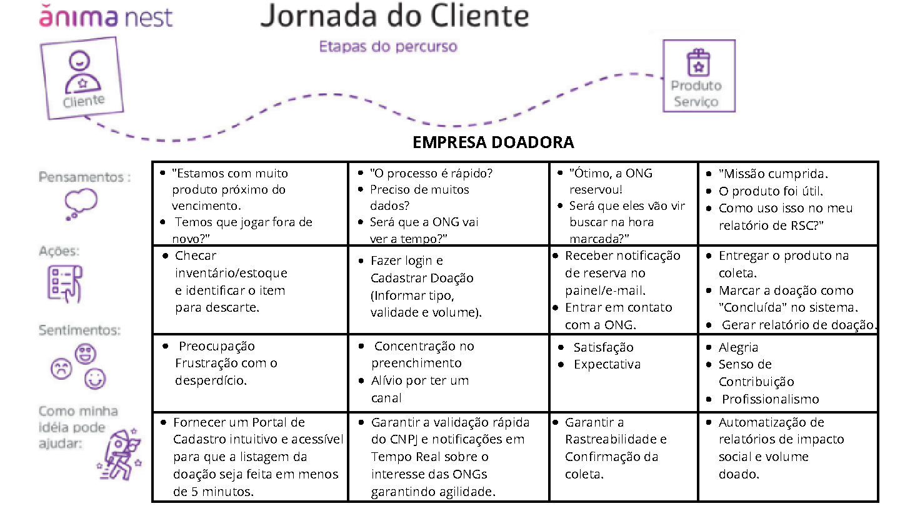

# Jornada do Usuário — Empresa Doadora

A jornada da empresa dentro do FoodBack foi construída para ser simples, rápida e eficiente, evitando etapas desnecessárias e minimizando o trabalho manual.

Etapas da Jornada

Identificação do excedente no estoque

Acesso ao sistema com login seguro

Cadastro da doação em poucos cliques

ONG visualiza e reserva o alimento

Comunicação integrada para retirada

Doação concluída com registro automático

Geração automática de relatório de responsabilidade social

Emoções da jornada

🟥 Frustração — ao perceber desperdício no estoque
🟧 Alívio — ao publicar rapidamente na plataforma
🟨 Satisfação — ao ver a ONG interessada
🟩 Propósito — ao concluir a doação e gerar impacto social

