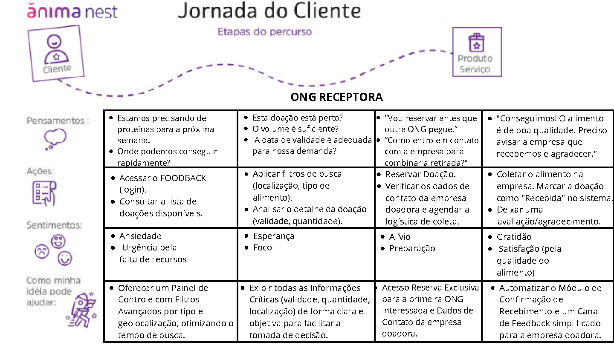

# Jornada do Usuário — ONG Receptora

A experiência da ONG foca em agilidade, clareza e confiança no processo.

Etapas da Jornada

Necessidade de alimento identificada

Acesso à plataforma

Filtro por tipo de alimento, localização ou urgência

Análise da condição e quantidade disponível

Reserva direta

Agendamento da coleta

Retirada física no local

Confirmação da doação no sistema

Avaliação da empresa doadora

Emoção da jornada

urgência → foco → organização → alívio → gratidão

